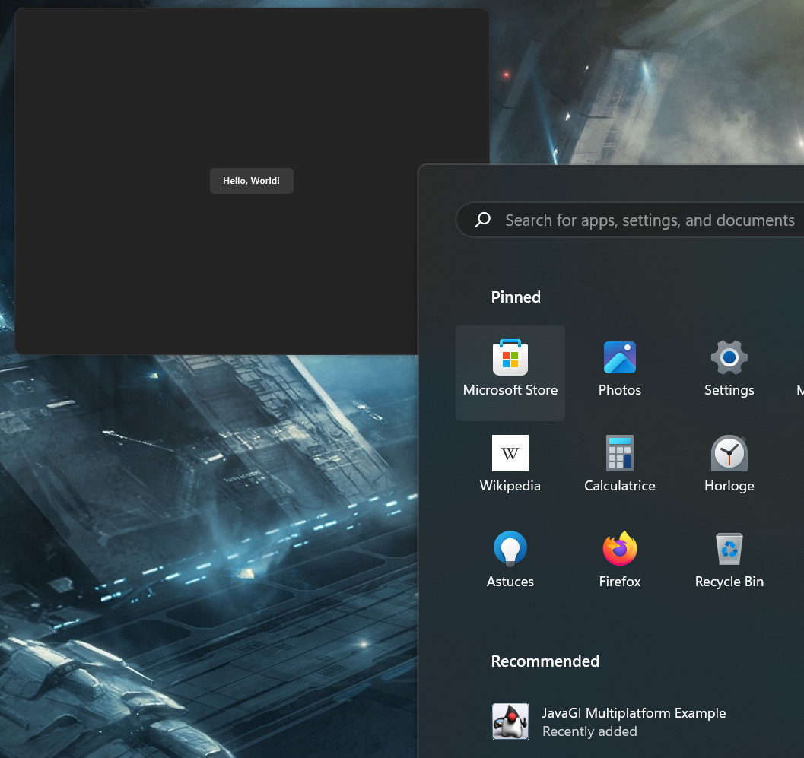

# Java-GI multiplatform started for Kotlin

Fork of [starter Java-GI app with multiplatform packaging from JFronny](https://github.com/JFronny/javagi-multiplatform) to use with kotlin.

Currently supports Windows (untested) and linux (tested with RPM package).

## Build Windows installer

### Prerequisits

- Java 22 : `winget install EclipseAdoptium.Temurin.22.JDK`
- WiX toolset 3.0 :
    - Download [`wix314-binaries.zip`](https://github.com/wixtoolset/wix3/releases)
    - Extract, store somewhere and add to path

### Build installer

```bash
./gradlew jpackage
```

Produces `msi` installer under `build/jpackage`.

